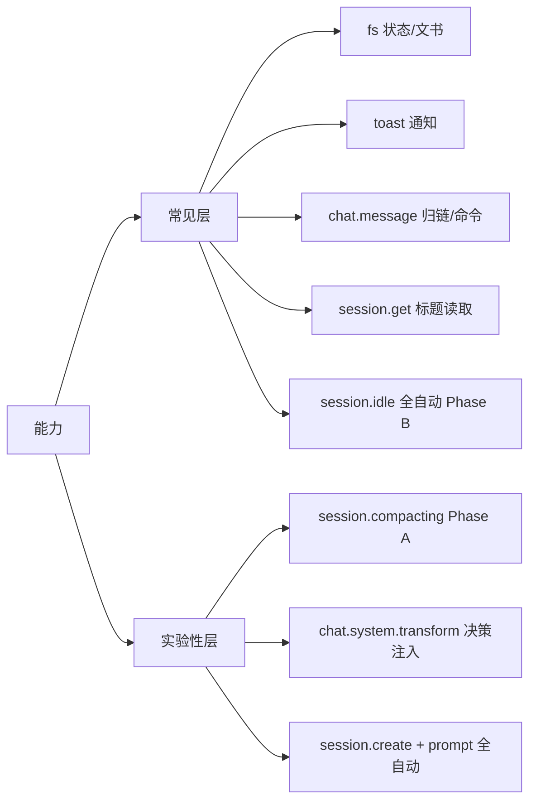

# 依赖的能力与 OpenCode 集成

本插件依赖 OpenCode 提供的插件 API 与 SDK 客户端。以下列出全部依赖面，及其可用性差异对降级路径的影响。

## 插件上下文 `ctx`

| 字段 | 用途 |
|------|------|
| `ctx.directory` | 项目根，用于定位 `handoff` 目录与状态文件（`join(directory, "handoff", ...)` 拼路径） |
| `ctx.client` | OpenCode SDK 客户端，用于 `tui.showToast` / `session.create` / `session.prompt` / `app.log` |
| `ctx.config` | 可选配置（`handoffDir` / `enterRegex` / `compactRegex`），带默认值 |
| `ctx.$` | 未使用（预留） |
| `ctx.project` / `ctx.worktree` | 未使用（当前版本） |

## Hook / 事件

| 名称 | 是否实验性 | 用途 |
|------|-----------|------|
| `event` + `session.compacted` | 稳定 | 累加会话压缩计数 |
| `event` + **`session.idle`** | 稳定 | **全自动触发 Phase B**：校验文书成品 → create 接力会话 → 注入交接语（v3 主通道） |
| `chat.message` | 稳定 | 哨兵触发 Phase B（兜底）/ 归链（`SR-xxx` token）/ 显式进接力 / `@relay` 命令 |
| `experimental.chat.system.transform` | **实验性** | 未归链会话注入决策 system 指令 |
| `experimental.session.compacting` | **实验性** | 归链会话压缩前执行 Phase A（骨架 + relayPrompt） |

> ⚠️ `experimental.` 前缀表示 OpenCode API 可能随版本调整。改动时须回归测试套件（`node test/test.mjs`，68 用例）。

## SDK 客户端能力

| 方法 | 用例 | 若不可用 |
|------|------|---------|
| `client.tui.showToast` | 决策/降级/命令反馈 | 静默降级（仅 console） |
| `client.session.get({path:{id}})` | 读取会话标题（v2 起） | 失败/空 → 文书基名回退 cid |
| `client.session.create` | 全自动创建接力会话 | 降级**半自动**（输出交接语） |
| `client.session.prompt` | 注入交接首条消息 | create 成功但注入失败 → 保留会话 + warning |

### create/prompt 返回结构

- `session.create` / `session.prompt` 返回 **RequestResult**，从 `data.*` 取实际对象（如 `data.id`）。
- 插件已做结构兜底：`newSession.data?.id || newSession.id`。

## 平台差异

- **桌面版（TUI）**：具备 `client.session.create` / `client.session.prompt` / `session.idle` → 走全自动路径。
- **CLI 版本**：若客户端不暴露 `session.prompt`（或 create），自动落到对应降级分支，功能仍可用（半自动）。

## 文件系统

| 项 | 限制 |
|----|------|
| `node:fs` / `node:path` / `node:crypto` | 内置模块，零第三方依赖 |
| 状态文件 | 单 JSON `handoff/.relay-state.json`，损坏时安全重置 |
| 路径 | 全部 `join(directory, ...)`，跨平台，无绝对盘符硬编码 |

运行时产物（不进项目）：`.relay-state.json` / `verify-result.json` / `refresh-result.json` / `.relay-ask.json` 生成于 opencode 项目根 `handoff/`。

## 开发 / 测试依赖

- Node.js ≥ 18（`package.json engines`）
- 测试：纯 Node（`node test/test.mjs`），无外部依赖；`RELAY_MAIN` 环境变量可测其他路径（如配置目录活实例）

## 能力矩阵

