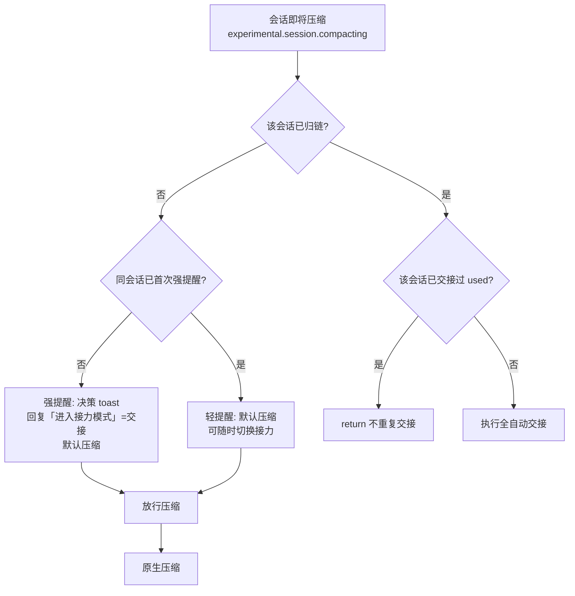
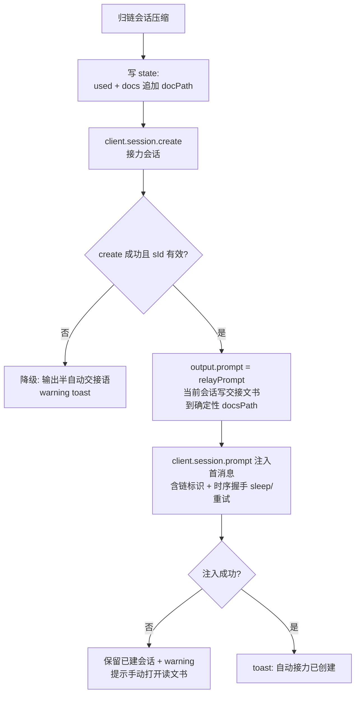
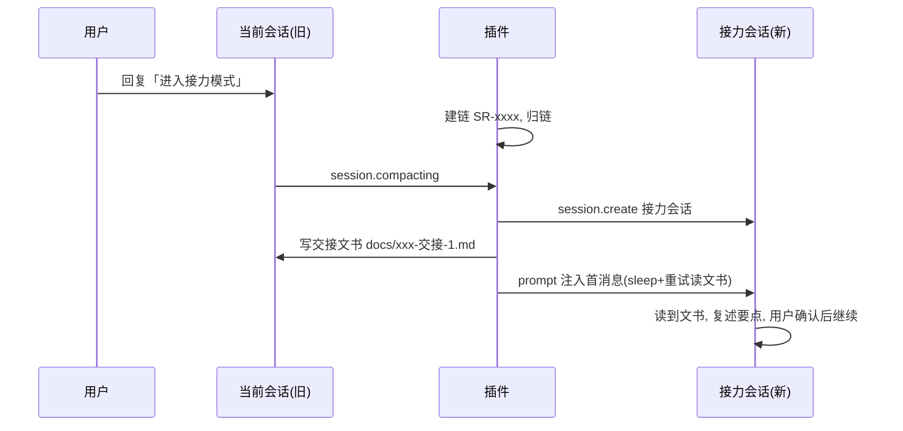

# 工作流程图

三类归一化流程：**决策**、**全自动交接**、**降级**。

## 总览



## 全自动交接（核心路径）



## 用户侧流程



## `@relay` 命令

```mermaid
flowchart LR
    A[@relay status] --> B[显示当前链: 跳数/归链会话/文书索引]<br/>C[@relay leave] --> D[退链<br/>下次压缩重新提示决策]
```
