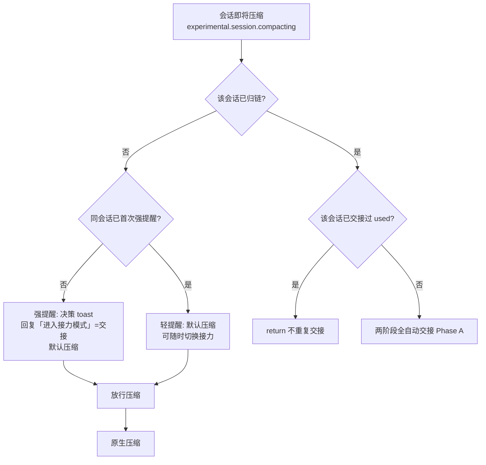
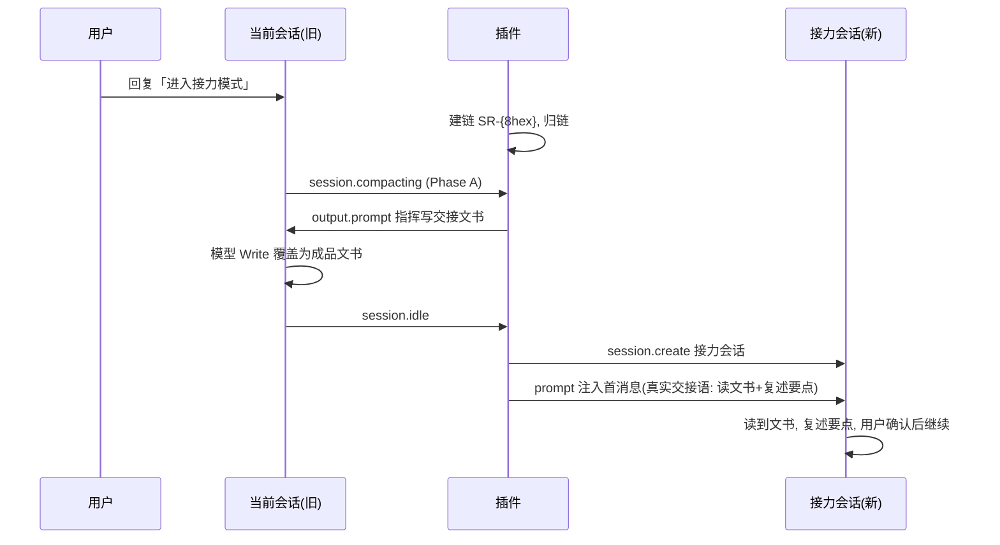

# 工作流程图

三类归一化流程：**决策**、**两阶段全自动交接（核心）**、**降级**。

## 总览



## 两阶段全自动交接（核心路径，v3）

```mermaid
flowchart TD
    A[归链会话压缩<br/>或 @relay handoff] --> B[Phase A<br/>seedDoc 骨架文书 + 挂起 pending]
    B --> C[设 output.prompt=relayPrompt<br/>指挥本会话模型<br/>Write 覆盖为成品文书]
    C --> D[Phase A 不建会话<br/>pending 挂起 state.pendingHandoffs]
    D --> E{文书被模型覆盖为成品?<br/>event.session.idle}
    E -- 是 --> F[Phase B 主通道<br/>docIsComplete 校验 → create 接力会话<br/>→ 注入真实交接语 → 清 pending]
    E -- 否/未触发 --> G[兜底: 用户回复哨兵<br/>[RELAY_HANDOFF_DONE]]
    G --> H{docIsComplete 校验}
    H -- 是 --> F
    H -- 否 --> I[告警: 文书未补全<br/>提示先补全, 可重发哨兵重试]
```

## 用户侧流程



## `@relay` 命令

```mermaid
flowchart LR
    A[@relay status] --> B[显示当前链: 跳数/归链会话/文书索引]
    C[@relay leave] --> D[退链<br/>下次压缩重新提示决策]
    E[@relay verify] --> F[自检: 探测 client 方法 + create→prompt→读回]
    G[@relay refresh] --> H[触发会话列表刷新]
    I[@relay handoff] --> J[手动两阶段交接<br/>不依赖压缩临界]
```
